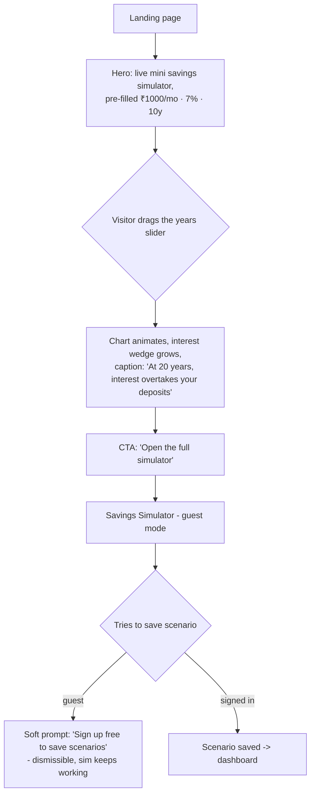
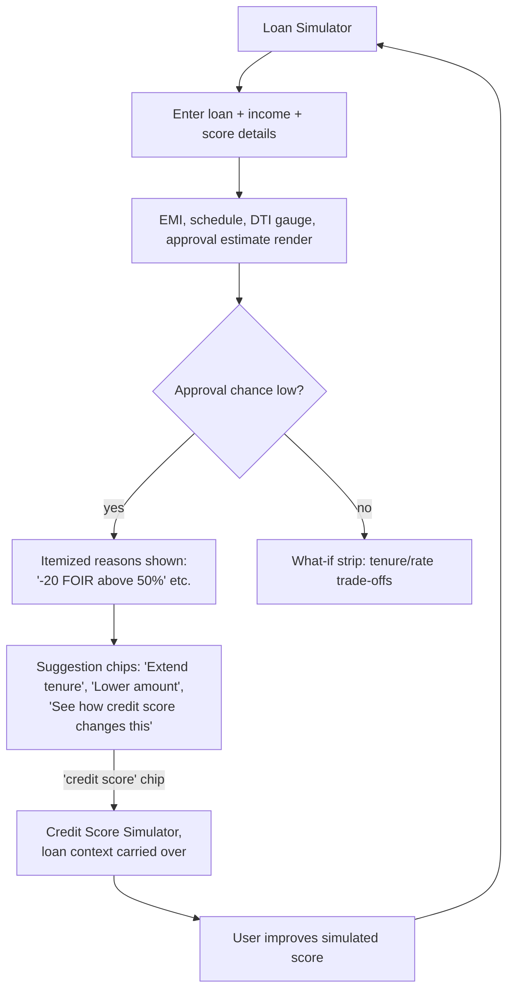
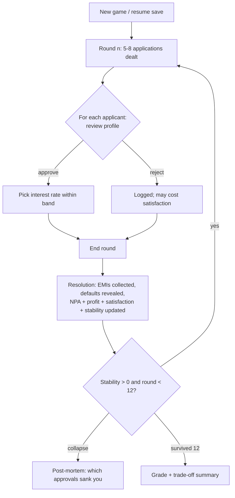

# 03 · User Flows

Conventions: `[Screen]`, `(decision)`, `--->` navigation. All flows assume guest access works everywhere; sign-up is only ever prompted when the user tries to **persist** something.

---

## Flow 1 · First visit → first aha moment (the golden path)

The landing page must get a first-time visitor to move a slider within ~10 seconds.

Key rule: **no signup wall, ever, in front of a simulator.**

## Flow 2 · Sign up / sign in

1. `[Auth page]` → choose Google OAuth **or** email + password.
2. Email path: enter email/password → verification email → click link → verified.
3. On first sign-in: optional 3-question onboarding (age band, "what do you want to understand first?", currency format preference) → personalizes dashboard ordering only. Skippable.
4. Anything the guest had in-session (unsaved scenario, quiz answers in progress) is offered for adoption into the new account (kept in localStorage until then).

## Flow 3 · Savings Simulator session

1. Enter from nav, landing CTA, dashboard, or a lesson deep-link (deep-links carry preset params in the URL query — all simulator state is URL-serializable).
2. Adjust inputs → results re-render instantly; explainer panel updates with the same numbers.
3. (optional) **Compare**: pin current scenario → second control set appears → charts show A vs B.
4. (optional) Open **AI tutor** → drawer slides in with context chips ("Explain my result", "Why is interest growing faster later?").
5. (optional) **Save** → named scenario → dashboard. **Share** (P2) → read-only URL.

The same shape applies to F2, F3, F6, F7 — they share the Simulator Layout.

## Flow 4 · Loan Simulator with rejection learning loop

This cross-feature loop (loan ↔ credit score) is the product's core teaching circuit.

## Flow 5 · Credit Score Simulator

1. Choose starting point: "new to credit" (650) or custom slider.
2. Tap action buttons (pay EMI on time / miss EMI / raise card utilization / ...) → gauge animates, event appends to a visible timeline, factor bars re-weight.
3. "Advance 3 months" → decay/recovery applied, timeline annotates it.
4. Side panel continuously shows loan eligibility at the current score.
5. Signed-in: journey autosaves; "replay my journey" animates the full history.

## Flow 6 · Bank Manager game loop

Guests play in-memory; signed-in users get one autosaved game slot.

## Flow 7 · Learning Hub lesson

1. `[Hub index]` — lesson cards with progress rings → pick lesson.
2. Lesson page: scroll through short sections; embedded mini-simulators are live (not screenshots).
3. Quiz (3–5 questions, instant feedback with explanation per answer — wrong answers teach, not punish).
4. Pass (≥ 60%) → completion badge + "next lesson" ; fail → "revisit these two sections" links, retry.
5. Progress persisted for signed-in users; guests see session-only progress with a soft save prompt.

## Flow 8 · AI Tutor

1. Floating tutor button on every page → drawer opens (page context auto-attached on simulator pages).
2. User picks a suggested chip or types a question.
3. Static-library match? → instant vetted answer (no LLM call). Otherwise → streamed LLM answer grounded in page context.
4. Rate limit reached (guest) → friendly note + sign-up prompt + static library remains available.
5. Every answer: "Was this clear?" 👍/👎 → 👎 stores the exchange for review.

## Flow 9 · ML Demonstration

1. Big banner: *Educational demonstration — not a real banking decision system.*
2. Read "how this model was trained" intro (dataset, features, split).
3. Enter applicant profile → all three models return approve/reject + confidence side by side (disagreement between models is itself a teaching moment).
4. Expand a prediction → feature-contribution bars.
5. Ethics panel is inline on the same page (not tucked away).

## Flow 10 · Goal Planner

1. Pick template or custom goal → set target amount + date (or monthly capacity).
2. Result: monthly saving needed, timeline, interest share; instrument-type suggestions by horizon.
3. (optional) toggle "inflation-adjust my target" → target grows, plan updates, explainer tells why.
4. Save goal (requires account) → dashboard card with manual progress updates.

## Flow 11 · Account management

- Dashboard → settings: profile, theme, currency format (lakh/crore vs million), email change (re-verify), password change, **delete account** (type-to-confirm → hard-deletes user data, audit log entry retained without PII).

## Session/state rules (all flows)

| State | Guest | Signed-in |
|---|---|---|
| Simulator inputs | URL query + localStorage | URL query + saved scenarios (DB) |
| Quiz/lesson progress | localStorage (session) | DB |
| Credit-sim / bank-game | in-memory + localStorage | DB (autosave) |
| AI conversations | in-memory only | DB |
| Rate limits | per-IP | per-user (higher) |
