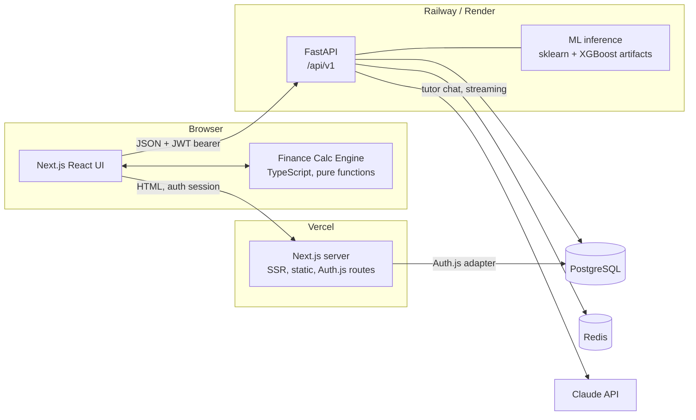

# 05 · System Architecture

## 1. High-level view



## 2. The single most important decision: simulations run client-side

All financial math (F1–F8) is a **pure TypeScript library in the browser** (`packages/finance-core`). The backend never computes an EMI.

**Why:**
- **Instant feedback** is a PRD principle (< 100 ms slider-to-chart). A network round trip per slider tick is unacceptable and expensive.
- The math is deterministic and non-secret — there is nothing to protect server-side.
- Simulators work fully in guest mode and even offline; URL query strings serialize the whole state, enabling shareable/deep-linkable scenarios with zero backend involvement.
- One implementation, unit-tested to death ([12-testing-strategy.md](12-testing-strategy.md)), no client/server drift.

**Consequence:** the backend stores *scenarios* (the inputs + a results snapshot for dashboard display), not calculations. Saved results are recomputed client-side on load; the snapshot is only a display cache.

## 3. Responsibility split

| Concern | Owner | Notes |
|---|---|---|
| Rendering, routing, SSR/SSG of marketing + lesson pages | Next.js | Lessons are MDX compiled at build time |
| Simulation math + game logic (credit sim, bank game rules) | `finance-core` TS package | Pure, framework-free, heavily tested |
| Authentication | Auth.js in Next.js | JWT session strategy; OAuth (Google) + credentials |
| Business API: scenarios, goals, progress, game saves, tutor, ML | FastAPI | Validates the Auth.js JWT (shared secret HS256 at first; JWKS if we ever split) |
| AI tutor | FastAPI → Claude API | Streaming SSE proxy; caching + rate limiting in Redis |
| ML training | Offline scripts in `ml/` | Produces versioned model artifacts committed/released, loaded by FastAPI at startup |
| Persistence | PostgreSQL | Single database, two schema owners: Auth.js tables + app tables (one Alembic migration line — see [06-database.md](06-database.md)) |
| Cache, rate limits, tutor response cache | Redis | Nothing in Redis is a source of truth |

**Why FastAPI owns the business API (rather than Next.js API routes):** the project's stated stack and learning goals include Python/FastAPI; ML inference must be Python anyway; and keeping *all* authenticated JSON endpoints in one service gives one place for validation, rate limiting, and audit logging instead of two half-backends.

**Auth flow:** Auth.js issues a JWT-strategy session. The frontend obtains a bearer token from a small Next.js route (`/api/token`) that re-signs the session claims (`sub`, `role`, `exp` ≤ 15 min) with the shared API secret. FastAPI middleware verifies it statelessly. Guests call the API without a token where allowed (tutor with low limits, ML demo) and are keyed by IP for rate limiting.

## 4. Tech stack justification

| Choice | Why | Considered alternative |
|---|---|---|
| **Next.js (App Router) + React + TS** | SSR for fast first paint + SEO on lesson content; static generation of MDX lessons; huge ecosystem; TS types shared with `finance-core` | Vite SPA — worse SEO/first-paint for the content half of the product |
| **Tailwind CSS** | Design-token discipline via config; fast iteration; pairs well with the design system in [10-design-system.md](10-design-system.md) | CSS modules — slower to iterate the heavy custom styling this UI needs |
| **Framer Motion** | Declarative number/graph/layout animation is the product's soul; spring physics; `useReducedMotion` built in | GSAP — imperative, licensing friction |
| **Recharts + custom SVG** | Declarative charts for standard forms; custom SVG (with FM) for signature animations (money growth, gauges) | D3 direct — more power than needed at higher cost |
| **FastAPI + Python** | Same language as ML stack; Pydantic validation mirrors Zod client-side; async + SSE streaming for tutor; automatic OpenAPI docs | Express/Nest — would strand the ML code in a second service anyway |
| **scikit-learn + XGBoost** | Standard, interpretable, small artifacts; feature importances/odds ratios are the *teaching content* | Deep learning — opaque, overkill, worse for the ethics lesson |
| **PostgreSQL** | Relational shape (users→scenarios→goals), JSONB for flexible sim payloads, boring and reliable | MongoDB — no advantage; relational integrity wanted for auth/progress |
| **Redis** | Rate limiting (sliding window), tutor answer cache, hot dashboard cache | In-process cache — dies on restart, can't rate-limit across instances |
| **Auth.js** | Stated requirement; first-class Next.js; credentials + OAuth + email verification flows | Clerk/Auth0 — vendor cost, less learning value |
| **Docker + GitHub Actions** | Reproducible API image; CI gates (lint/test/build) per [12-testing-strategy.md](12-testing-strategy.md) | — |
| **Vercel (web) + Railway/Render (API+PG+Redis)** | Vercel cannot host long-running Python or Redis; split hosting is the standard pattern. Railway/Render give Docker deploys, managed Postgres/Redis, and free-ish tiers | Fly.io equally fine; decision deferred to M8, abstracted behind Docker |

## 5. Component map (frontend)

```
app/
 ├─ (marketing)  landing, about
 ├─ (sims)       savings, compound, loan, credit-score, inflation,
 │               investments, goals, bank-game   ← all use <SimulatorShell>
 ├─ learn/       hub index + [slug] lesson pages (MDX)
 ├─ ml-demo/
 ├─ dashboard/
 └─ auth/

components/
 ├─ simulator/   SimulatorShell, ControlsPanel, StatRow, ExplainerPanel,
 │               CompareToggle, SaveScenarioButton
 ├─ charts/      GrowthAreaChart, AmortizationBars, DonutSplit, ScoreGauge,
 │               DTIGauge, TimelineStrip, ChartTableTab (a11y twin)
 ├─ tutor/       TutorFab, TutorDrawer, SuggestionChips, StreamedMessage
 └─ ui/          Button, GlassCard, Slider, Field, Tabs, Badge, Toast, Modal
```

## 6. Data flows (representative)

**Slider change (F1):** input → `finance-core.savings.project(inputs)` → memoized series → charts + stat row + explainer re-render. No network.

**Save scenario:** click → `POST /api/v1/scenarios` `{type:"savings", name, inputs, summary}` with bearer token → row in `scenarios` → optimistic UI + toast.

**Tutor question:** drawer submit → `POST /api/v1/tutor/messages` (context payload = page id + current inputs/outputs) → FastAPI: rate-limit check (Redis) → static-library match? return instantly → else cache lookup (hash of normalized question+context) → else Claude API streaming call → SSE chunks to client → full answer cached + persisted (if signed in).

**ML predict:** form → `POST /api/v1/ml/predict` → Pydantic validation → three in-memory models score → response with per-model verdicts, probabilities, feature contributions → prediction logged (anonymous ok) for the "recent predictions" teaching table.

**Bank game round:** all round resolution logic is `finance-core/bank-game` (client), seeded RNG so a saved game replays identically; autosave `PUT /api/v1/bank-games/{id}` with full state JSONB.

## 7. AI tutor model choice

Streaming chat via the official Python SDK (`client.messages.stream`). Per current Claude API guidance the default engineering choice is `claude-opus-4-8` ($5/$25 per MTok); given this product's short, high-volume, cost-sensitive explanations, the model is a **config value** (`TUTOR_MODEL`) with a documented trade-off for the owner to pick at M6:

| Option | Price (in/out per MTok) | Fit |
|---|---|---|
| `claude-opus-4-8` (default) | $5 / $25 | Best explanations; fine while traffic is small |
| `claude-sonnet-5` | $3 / $15 (intro $2/$10 to 2026-08-31) | Strong quality/cost middle ground |
| `claude-haiku-4-5` | $1 / $5 | Cheapest; likely sufficient for grounded 200-token explanations |

Cost controls regardless of model: prompt caching on the fixed tutor system prompt, ≤ 500-token responses, Redis answer cache, static library short-circuit, per-user daily caps, monthly spend alarm.

## 8. Cross-cutting decisions

- **URL as state:** every simulator's full input state serializes to query params (shareable, deep-linkable from lessons, restorable).
- **Versioned APIs:** everything under `/api/v1`; breaking changes bump the prefix.
- **Versioned models:** ML artifacts named `loan_xgb_v3.joblib` etc.; the API reports model version in every prediction response.
- **Observability:** Sentry (web + API), structured JSON logs in FastAPI, `/healthz` + `/readyz` endpoints ([13-deployment.md](13-deployment.md)).
- **Feature flags:** a simple env/config-driven flag map gates P2 features (share links, prepayment explorer) so `main` stays deployable.
- **i18n readiness:** all UI strings through a message catalog from day one; currency/number formatting through one `formatMoney()` util (lakh/crore aware) — no hardcoded "₹" scattered in JSX.
