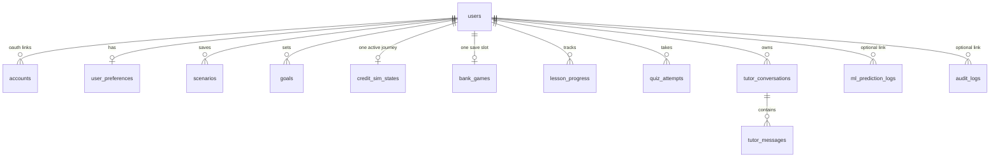

# 06 · Database Design

One PostgreSQL database. Auth.js owns its four standard tables (created by its adapter, then frozen into our Alembic baseline so there is a single migration lineage). Everything else is owned by FastAPI/Alembic. Redis is cache-only — never a source of truth.

## 1. ER diagram



## 2. Schema (DDL)

```sql
-- ============ AUTH (Auth.js adapter shape, JWT session strategy) ============
CREATE TABLE users (
    id             UUID PRIMARY KEY DEFAULT gen_random_uuid(),
    name           TEXT,
    email          TEXT UNIQUE NOT NULL,
    email_verified TIMESTAMPTZ,
    image          TEXT,
    password_hash  TEXT,                    -- argon2id; NULL for OAuth-only users
    role           TEXT NOT NULL DEFAULT 'student'
                   CHECK (role IN ('student','educator','admin')),
    created_at     TIMESTAMPTZ NOT NULL DEFAULT now(),
    deleted_at     TIMESTAMPTZ              -- soft-delete marker during 7-day grace
);

CREATE TABLE accounts (                      -- OAuth provider links (Auth.js)
    id                  UUID PRIMARY KEY DEFAULT gen_random_uuid(),
    user_id             UUID NOT NULL REFERENCES users(id) ON DELETE CASCADE,
    provider            TEXT NOT NULL,
    provider_account_id TEXT NOT NULL,
    type                TEXT NOT NULL,
    access_token        TEXT, refresh_token TEXT, expires_at BIGINT,
    UNIQUE (provider, provider_account_id)
);

CREATE TABLE verification_tokens (           -- email verification / reset (Auth.js)
    identifier TEXT NOT NULL,
    token      TEXT NOT NULL,
    expires    TIMESTAMPTZ NOT NULL,
    PRIMARY KEY (identifier, token)
);
-- (JWT strategy: no sessions table needed)

-- ============ APP ============
CREATE TABLE user_preferences (
    user_id        UUID PRIMARY KEY REFERENCES users(id) ON DELETE CASCADE,
    theme          TEXT NOT NULL DEFAULT 'system' CHECK (theme IN ('light','dark','system')),
    number_format  TEXT NOT NULL DEFAULT 'indian' CHECK (number_format IN ('indian','international')),
    reduced_motion BOOLEAN NOT NULL DEFAULT false,
    onboarding     JSONB NOT NULL DEFAULT '{}'::jsonb,
    updated_at     TIMESTAMPTZ NOT NULL DEFAULT now()
);

CREATE TABLE scenarios (                     -- saved simulator states
    id          UUID PRIMARY KEY DEFAULT gen_random_uuid(),
    user_id     UUID NOT NULL REFERENCES users(id) ON DELETE CASCADE,
    sim_type    TEXT NOT NULL CHECK (sim_type IN
                ('savings','compound','loan','inflation','investment','goal_preview')),
    name        TEXT NOT NULL CHECK (char_length(name) BETWEEN 1 AND 80),
    inputs      JSONB NOT NULL,              -- exact simulator input state (versioned shape)
    summary     JSONB NOT NULL,              -- display cache: {final, deposited, interest,...}
    engine_ver  TEXT NOT NULL,               -- finance-core version that produced summary
    is_public   BOOLEAN NOT NULL DEFAULT false,   -- P2 share links
    share_slug  TEXT UNIQUE,                       -- P2
    created_at  TIMESTAMPTZ NOT NULL DEFAULT now(),
    updated_at  TIMESTAMPTZ NOT NULL DEFAULT now()
);
CREATE INDEX idx_scenarios_user ON scenarios (user_id, updated_at DESC);

CREATE TABLE goals (
    id              UUID PRIMARY KEY DEFAULT gen_random_uuid(),
    user_id         UUID NOT NULL REFERENCES users(id) ON DELETE CASCADE,
    title           TEXT NOT NULL,
    emoji           TEXT NOT NULL DEFAULT '🎯',
    target_amount   NUMERIC(14,2) NOT NULL CHECK (target_amount > 0),
    target_date     DATE NOT NULL,
    expected_return NUMERIC(5,2) NOT NULL DEFAULT 6.0,   -- % p.a.
    inflation_adjust BOOLEAN NOT NULL DEFAULT false,
    saved_so_far    NUMERIC(14,2) NOT NULL DEFAULT 0,    -- manual progress updates
    status          TEXT NOT NULL DEFAULT 'active'
                    CHECK (status IN ('active','achieved','abandoned')),
    created_at      TIMESTAMPTZ NOT NULL DEFAULT now(),
    updated_at      TIMESTAMPTZ NOT NULL DEFAULT now()
);
CREATE INDEX idx_goals_user ON goals (user_id, status);

CREATE TABLE credit_sim_states (             -- one active journey per user
    user_id     UUID PRIMARY KEY REFERENCES users(id) ON DELETE CASCADE,
    score       SMALLINT NOT NULL CHECK (score BETWEEN 300 AND 900),
    factors     JSONB NOT NULL,              -- {payment_history:.., utilization:.., ...}
    events      JSONB NOT NULL DEFAULT '[]'::jsonb,  -- ordered action timeline
    sim_months  INT NOT NULL DEFAULT 0,      -- simulated time elapsed
    updated_at  TIMESTAMPTZ NOT NULL DEFAULT now()
);

CREATE TABLE bank_games (                    -- one save slot per user
    user_id     UUID PRIMARY KEY REFERENCES users(id) ON DELETE CASCADE,
    rng_seed    BIGINT NOT NULL,             -- deterministic replay
    round       SMALLINT NOT NULL DEFAULT 1,
    state       JSONB NOT NULL,              -- capital, npa, satisfaction, loans[], history[]
    status      TEXT NOT NULL DEFAULT 'active'
                CHECK (status IN ('active','won','collapsed')),
    updated_at  TIMESTAMPTZ NOT NULL DEFAULT now()
);

CREATE TABLE lesson_progress (               -- lesson content lives in MDX, not DB
    user_id      UUID NOT NULL REFERENCES users(id) ON DELETE CASCADE,
    lesson_slug  TEXT NOT NULL,
    status       TEXT NOT NULL DEFAULT 'in_progress'
                 CHECK (status IN ('in_progress','completed')),
    section_idx  SMALLINT NOT NULL DEFAULT 0,
    completed_at TIMESTAMPTZ,
    PRIMARY KEY (user_id, lesson_slug)
);

CREATE TABLE quiz_attempts (
    id          UUID PRIMARY KEY DEFAULT gen_random_uuid(),
    user_id     UUID NOT NULL REFERENCES users(id) ON DELETE CASCADE,
    lesson_slug TEXT NOT NULL,
    score_pct   SMALLINT NOT NULL CHECK (score_pct BETWEEN 0 AND 100),
    answers     JSONB NOT NULL,              -- [{q_id, chosen, correct}]
    passed      BOOLEAN NOT NULL,
    created_at  TIMESTAMPTZ NOT NULL DEFAULT now()
);
CREATE INDEX idx_quiz_user_lesson ON quiz_attempts (user_id, lesson_slug, created_at DESC);

CREATE TABLE tutor_conversations (
    id         UUID PRIMARY KEY DEFAULT gen_random_uuid(),
    user_id    UUID NOT NULL REFERENCES users(id) ON DELETE CASCADE,
    title      TEXT NOT NULL DEFAULT 'New conversation',
    page_ctx   TEXT,                         -- e.g. 'sim:savings'
    created_at TIMESTAMPTZ NOT NULL DEFAULT now()
);

CREATE TABLE tutor_messages (
    id              UUID PRIMARY KEY DEFAULT gen_random_uuid(),
    conversation_id UUID NOT NULL REFERENCES tutor_conversations(id) ON DELETE CASCADE,
    role            TEXT NOT NULL CHECK (role IN ('user','assistant')),
    content         TEXT NOT NULL,
    source          TEXT NOT NULL DEFAULT 'llm' CHECK (source IN ('llm','static','cache')),
    flagged         BOOLEAN NOT NULL DEFAULT false,   -- 👎 feedback
    tokens_used     INT,
    created_at      TIMESTAMPTZ NOT NULL DEFAULT now()
);
CREATE INDEX idx_tutor_msgs_conv ON tutor_messages (conversation_id, created_at);

CREATE TABLE ml_prediction_logs (
    id            UUID PRIMARY KEY DEFAULT gen_random_uuid(),
    user_id       UUID REFERENCES users(id) ON DELETE SET NULL,  -- guests: NULL
    model_name    TEXT NOT NULL,             -- 'logreg' | 'rf' | 'xgb'
    model_version TEXT NOT NULL,
    inputs        JSONB NOT NULL,
    outputs       JSONB NOT NULL,            -- {approved, prob, risk, contributions[]}
    created_at    TIMESTAMPTZ NOT NULL DEFAULT now()
);

CREATE TABLE audit_logs (
    id          BIGINT GENERATED ALWAYS AS IDENTITY PRIMARY KEY,
    user_id     UUID REFERENCES users(id) ON DELETE SET NULL,
    action      TEXT NOT NULL,               -- 'auth.login','auth.fail','scenario.create',
                                             -- 'account.delete','admin.*',...
    resource    TEXT,                        -- 'scenarios/9f2e...'
    ip_hash     TEXT,                        -- SHA-256(ip + daily rotating salt), never raw IP
    user_agent  TEXT,
    meta        JSONB NOT NULL DEFAULT '{}'::jsonb,
    created_at  TIMESTAMPTZ NOT NULL DEFAULT now()
);
CREATE INDEX idx_audit_user_time ON audit_logs (user_id, created_at DESC);
CREATE INDEX idx_audit_action_time ON audit_logs (action, created_at DESC);
```

## 3. Design notes & rationale

- **JSONB for simulator payloads** (`scenarios.inputs`, `bank_games.state`, `credit_sim_states.events`): simulator input shapes will evolve per feature; each payload carries a `v` field and `engine_ver` records which finance-core produced it, so old scenarios can be migrated or recomputed knowingly. Relational columns are reserved for what we query/filter on.
- **One-row-per-user tables** (`credit_sim_states`, `bank_games`): deliberate product decision — one active journey / one save slot keeps the UX and schema simple. Moving to multiple slots later = drop the PK to `(user_id, slot)`.
- **Lesson content is code, not data.** MDX ships with the frontend build (reviewable in PRs, versioned in git). The DB stores only progress/attempts keyed by `lesson_slug`.
- **`ml_prediction_logs`** exists for the feature itself (a "recent predictions" teaching table + monitoring for drift in what users try), not analytics creep. No PII in inputs by design of the form.
- **Account deletion:** `deleted_at` set immediately (login blocked), hard `DELETE FROM users` after a 7-day grace job — cascades wipe everything; `audit_logs.user_id` nulls out, keeping an anonymized trail.
- **Numeric money** columns use `NUMERIC(14,2)` (goals) — sufficient to ₹99,99,99,99,999.99; JSONB payload money values are integers in paise where exactness matters.

## 4. Redis keyspace (cache only)

| Key pattern | Value | TTL | Purpose |
|---|---|---|---|
| `rl:{scope}:{route}:{id}` | sliding-window counters | window | Rate limiting (scope = user/ip) |
| `tutor:ans:{sha256(q+ctx)}` | JSON answer | 7 d | Tutor response cache |
| `tutor:budget:{yyyymm}` | int (tokens spent) | 40 d | Monthly LLM spend guard |
| `dash:{user_id}` | dashboard aggregate JSON | 60 s | Dashboard hot cache |
| `mlstats:{model}` | rolling prediction stats | 24 h | ML demo "recent predictions" |

## 5. Migration & seed strategy

- **Alembic** owns all migrations (auth tables included in the baseline migration).
- Seed script (dev/test only): 3 demo users (student/educator/admin), sample scenarios, a mid-game bank save, lesson progress fixtures.
- Every migration must be reversible (`downgrade` implemented) until v1 launch.
